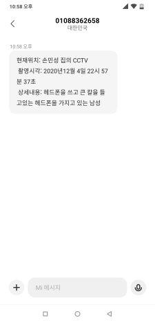
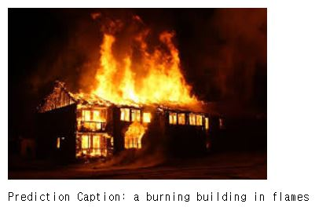
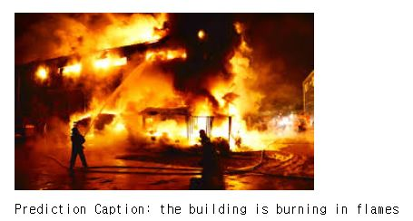

# tensorflow-image_captioning

### 사전절차 
* Tensorflow gpu 설치

## 훈련 

### 1. train.ipynb 실행<br> 


## server 실행

### 사전절차
* 사실 본인의 docker를 통한 gpu tensorflow서버에서 돌려놓은 모델의 checkpoint를 삽입 하려 했으나
  gpu의 성능이 너무낮아 <br> 충분한 학습이 이루어지지않았다. 하지만 데이터 학습과정에서 epoch에 따른 val_loss가 감소하는것을 확인하였으니 사용자가 만족할만큼의 학습을 진행한후 저장된 checkpoint를 사용할것.


### 1. cool-sms가입 & 설치
* open API로 최초가입시 15통까지의 문자를 공짜로 사용할수있음
<br>https://coolsms.co.kr/
```bash
 !pip install coolsms_python_sdk
```

### 2.naver 파파고 API 받기 & 설정
<br>

### 3.ip주소와 port 번호 설성
```bash
HOST = 'SERVER_IP' <- 각자 설정한 server의 IP번호
PORT = 'SERVER_PORT' <- 각자 설정한 server의 Port번호
```
<br>

### 4.실행
```bash
python TCP_SERVER.py
```

### 5. 서버에서 자동 실행을 원한다면
```bash
systemctl service를 이용한 자동 부팅 실행 적용할것.
```

# 중요 사항
### 1. 문장 정확도 비교를 위한 다양한 문장 유사도 평가함수 적용
### 2. 12만여개의 이미지 60여개의 캡셔닝 문장을 데이터로 사용
### 3. val loss와 train loss의 확인을 위한 csv 저장
### 4. 핸드폰으로 sms 전송
### 5. 만들어진 문장 자동 번역
### 6. 문장에 나타난 단어에 따른 위험 안내 서비스
### 소스코드의 자세한 내용은 train.ipynb를 참조할것

# 결과
## 이미지
<p align="center"></p>

## 캡셔닝된 문장
<p align="center"></p>
<br>

# TEST EXAMPLE
<br
<p align="center"></p>

<br>
<p align="center"></p>
<br>
<p align="center"></p>
<br>
